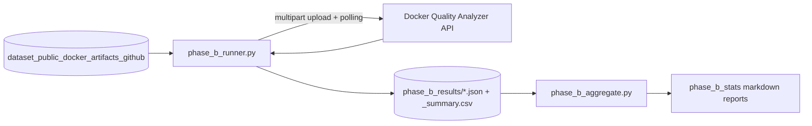

# Phase B Empirical Evaluation

This document describes the Phase B evaluation of the Docker Quality Analyzer: a large-scale application of the platform's analyzers to a fixed corpus of publicly available Docker artifacts, conducted through the platform's own public API. It covers the methodology, the tooling, the produced outputs, and the headline results, and provides reproduction instructions.

The detailed statistics report (`phase_b_stats.md`) is maintained in Greek; this document provides the English methodological description and an English summary of the results. The Greek artifacts are left unmodified.

## 1. Objective

To assess, quantitatively and at scale, the quality characteristics that the platform detects in real-world Docker artifacts — grade and score distributions, the most frequent finding codes, the prevalence of well-known anti-patterns, and Compose deployment runnability — and simultaneously to exercise the platform's reliability under batch workload (completion rate as a dependability indicator).

## 2. Dataset

The input corpus is the curated dataset in [`dataset_public_docker_artifacts_github/`](dataset_public_docker_artifacts_github/README.md):

- 102 artifacts in total: 49 Dockerfiles and 53 Compose manifests;
- stratified into 46 `production` artifacts (widely used open-source projects) and 56 `curated-examples` artifacts (Docker's official `awesome-compose` collection);
- full provenance per artifact in `manifest.csv` (original repository path, line count, stratum).

Artifacts are used exclusively as static analysis inputs; nothing is built or executed during the evaluation.

## 3. Pipeline Architecture



### 3.1 Submission and Collection — `phase_b_runner.py`

The runner is a dependency-free Python 3 script (standard library only) that drives the platform exactly as an external API client would:

1. **Authentication.** Registers (idempotently) and logs in a dedicated evaluation account, obtaining a JWT Bearer token via `/auth/register` and `/auth/login`.
2. **Submission.** Uploads every file under `dataset/dockerfiles/` to `POST /api/v1/dockerfile/analyze` and every file under `dataset/compose/` to `POST /api/v1/compose/analyze` as `multipart/form-data`.
3. **Polling.** Polls `GET /api/v1/users/me/jobs/{job_id}` every 2 seconds, up to 90 attempts (180 s) per artifact, until the job reports `done`/`completed` or `failed`; timeouts and failures are recorded explicitly (`_timeout`, `_failed`).
4. **Persistence.** Writes one JSON file per artifact to `phase_b_results/` (`{stem}__{type}.json`, containing the filename, artifact type, and the full analysis result) and a run-level `_summary.csv` (`file,type,status,score,grade`).

### 3.2 Aggregation — `phase_b_aggregate.py`

The aggregator loads all per-artifact JSON results and derives:

- **Grade distribution and mean scores** per artifact type (Dockerfile, Compose) and overall;
- **Most frequent finding codes** (top 12), counting both total occurrences and the number of files with at least one occurrence;
- **Prevalence of key anti-patterns**: `:latest` base images (DL3007), missing `USER` instruction (SEC002), unpinned dependencies (DL3008/DL3013/DL3016/DL3018), hard-coded secrets/passwords in security findings, Compose images without explicit tags;
- **Compose runnability**, evaluated from the per-rule precheck outcomes in `meta.runnability.rules` (an artifact is runnable if and only if all rules pass), together with per-rule failure rates and the distribution of blocking reasons.

It writes a consolidated Markdown report (`phase_b_stats_final.md`).

## 4. Outputs

| Artifact | Content |
| --- | --- |
| `phase_b_results/*.json` | Raw per-artifact analysis results (one file per submitted artifact) |
| `phase_b_results/_summary.csv` | Run-level summary: file, type, status, score, grade |
| `phase_b_stats.md` | Statistics report of the recorded run (in Greek) |
| `phase_b_stats_final.md` | Output of the v2 aggregator with refined runnability detection (generated; in Greek) |

## 5. Headline Results (Recorded Run)

The following figures summarize, in English, the recorded run as reported in `phase_b_stats.md`.

### 5.1 Completion and Reliability

- 102 of 102 artifacts (100.0%) completed analysis successfully — used as a dependability indicator for the platform under batch workload.

### 5.2 Grade Distribution

| Type | A | B | C | D | F | Mean score |
| --- | ---: | ---: | ---: | ---: | ---: | ---: |
| Dockerfile (n=49) | 4 | 25 | 12 | 6 | 2 | 71.9 |
| Compose (n=53) | 1 | 2 | 7 | 1 | 42 | 23.1 |
| Total (n=102) | 5 | 27 | 19 | 7 | 44 | 46.6 |

Dockerfiles in the corpus score markedly higher than Compose manifests, whose scores are dominated by style and configuration findings (key ordering, port quoting, missing explicit tags) and security findings.

### 5.3 Most Frequent Finding Codes (Top 6 of 12)

| Code | Occurrences | Files with ≥1 occurrence |
| --- | ---: | ---: |
| `service-keys-order` | 557 | 49/102 (48.0%) |
| `SEC001` | 337 | 59/102 (57.8%) |
| `services-alphabetical-order` | 171 | 28/102 (27.5%) |
| `require-quotes-in-ports` | 150 | 42/102 (41.2%) |
| `no-unbound-port-interfaces` | 147 | 49/102 (48.0%) |
| `service-image-require-explicit-tag` | 66 | 25/102 (24.5%) |

The full top-12 table is available in `phase_b_stats.md`.

### 5.4 Prevalence of Key Anti-Patterns

- Dockerfiles with a non-pinned (`:latest`) base image (DL3007): 4/49 (8.2%)
- Dockerfiles without a `USER` instruction: 38/49 (77.6%)
- Dockerfiles with unpinned dependencies (DL3008/DL3013/DL3016): 8/49 (16.3%)
- Files with a secret/password security finding: 33/102 (32.4%)
- Compose services using an image without an explicit tag: 25/53 (47.2%)

### 5.5 Compose Runnability

The recorded report lists the frequency of blocking-reason patterns across the corpus (most common: `env_file` dependencies, external volumes/networks, unresolved `${VAR}` substitutions — each touching all 53 Compose files — followed by bind mounts in 33 and build contexts in 32). Runnability classification is sensitive to how per-rule outcomes are read from the result metadata; the v2 aggregator (`phase_b_aggregate.py`) derives the runnable/blocked verdict strictly from `meta.runnability.rules` (all rules must pass) and should be treated as the authoritative computation when regenerating statistics.

## 6. Reproduction

1. Start the platform (see the root [README.md](README.md)):

```bash
./scripts/start.sh
```

2. Run the submission pipeline against the dataset (the runner targets `http://localhost:8000` by default; adjust `BASE` in the script if the API is exposed elsewhere):

```bash
python3 phase_b_runner.py dataset_public_docker_artifacts_github
```

3. Aggregate the results:

```bash
python3 phase_b_aggregate.py phase_b_results/
```

This regenerates the consolidated statistics report (`phase_b_stats_final.md`). Note that absolute figures may differ from the recorded run if the analyzers' rule sets have evolved since that run; the recorded outputs in `phase_b_results/` and `phase_b_stats.md` document the state at evaluation time.

## Related Documents

- [dataset_public_docker_artifacts_github/README.md](dataset_public_docker_artifacts_github/README.md) — dataset composition and provenance
- [Root README](README.md) — platform overview and architecture
- [backend/README.md](backend/README.md) — analyzers and plugin system
