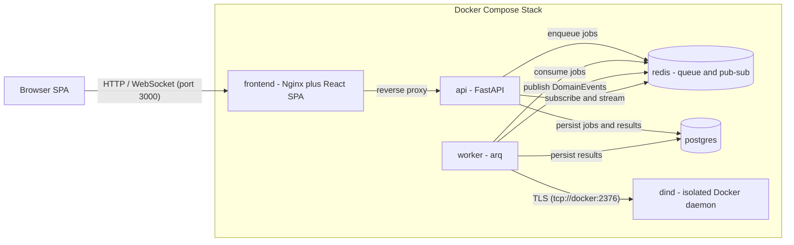

# Docker Quality Analyzer

Docker Quality Analyzer is a multi-tenant web platform for the static analysis, quality scoring, and controlled deployment of Docker artifacts. Users submit `Dockerfile`s, Docker Compose manifests, or complete project archives, and the platform produces structured quality reports covering best-practice conformance, security findings, resource estimation, and deployment readiness. Runnable Compose stacks may additionally be deployed to an isolated Docker-in-Docker (DinD) daemon and observed in real time.

The repository also contains the materials of an empirical evaluation (Phase B) in which the platform was applied to a curated dataset of 102 publicly available Docker artifacts; see [README-evaluation.md](README-evaluation.md) and [dataset_public_docker_artifacts_github/README.md](dataset_public_docker_artifacts_github/README.md).

## Table of Contents

1. [Core Capabilities](#core-capabilities)
2. [System Architecture](#system-architecture)
3. [Analysis Plugin System](#analysis-plugin-system)
4. [Workflows](#workflows)
5. [Installation and Operation](#installation-and-operation)
6. [Configuration](#configuration)
7. [Ports Reference](#ports-reference)
8. [Repository Structure](#repository-structure)
9. [Examples and Demonstration Artifacts](#examples-and-demonstration-artifacts)
10. [Local Development Without Docker](#local-development-without-docker)
11. [Onboarding Guide](#onboarding-guide)
12. [Related Documents](#related-documents)

## Core Capabilities

- **Dockerfile analysis.** Static inspection combining [Hadolint](https://github.com/hadolint/hadolint) with custom security and best-practice rules. Each analysis yields a numeric quality score, a letter grade (A–F), categorized findings (errors, warnings, suggestions, security issues), and a resource estimate.
- **Compose validation and runnability assessment.** Compose manifests are validated structurally and then subjected to a pre-flight *runnability* check that determines whether the stack can be deployed safely inside the platform's isolated runtime. Blocking conditions include host bind mounts, build contexts, `privileged` mode, host networking, `env_file` dependencies, unresolved `${VAR}` substitutions, external volumes/networks, and images without an explicit non-`latest` tag.
- **Project archive analysis.** Users upload `.zip` archives of complete projects. The backend performs a safe scan of the archive tree, detects all Dockerfiles and Compose manifests, analyzes each detected file separately, and merges the outcomes into a single project-level result (`per_file_results`, `project_summary`, `service_mappings`, and optionally `image_build_results`).
- **Controlled container execution.** Compose stacks that pass the runnability check may be deployed, on explicit user action only, to an isolated Docker-in-Docker daemon. The host Docker socket is never exposed to user workloads.
- **Real-time monitoring.** Container lifecycle events, logs, and CPU/memory metrics are streamed to the browser over WebSockets. Terminal container states (`exited`, `failed`, `unhealthy`, `partial`, `stopped_by_user`) are treated as first-class states and never misrepresented as live.
- **Per-user history.** All analyses and deployments are persisted per user and retrievable through the history API and UI.
- **Research analytics.** Aggregated, anonymized analytics are exposed through dedicated research endpoints; no personally identifying fields are ever included (see the research-privacy constraints in the backend documentation).

## System Architecture

The platform is composed of six services orchestrated by Docker Compose. The backend follows a modular-monolith design with a hexagonal (ports-and-adapters) internal structure; a single backend image serves both the HTTP API role and the asynchronous worker role.

| Service  | Role                                                            | Exposed port |
| -------- | --------------------------------------------------------------- | ------------ |
| frontend | React SPA served by Nginx, which also reverse-proxies the API   | `3000:80`    |
| api      | FastAPI HTTP and WebSocket server (uvicorn)                     | `8000:8000`  |
| worker   | `arq` task worker (same image as `api`, different command)      | —            |
| dind     | Isolated Docker-in-Docker daemon for user workloads (privileged) | —            |
| redis    | Task queue (`arq`) and publish/subscribe event bus              | `6379`       |
| postgres | Primary relational database                                     | `5432`       |

Startup ordering is gated by health checks: `frontend → api → redis, postgres` and `worker → dind, redis, postgres`.



### Asynchronous Job Pipeline

1. An API router receives an upload, creates a job record in PostgreSQL, and enqueues an `arq` task via Redis.
2. The worker picks up the task and executes `AnalysisService.run_job_with_plugins()`, selecting the plugin set appropriate to the job type.
3. During execution the worker publishes `DomainEvent`s to Redis publish/subscribe channels.
4. WebSocket endpoints on the API subscribe to those channels and stream events to the browser, which renders live progress.

### Redis Channel Naming

| Channel pattern | Content |
| --- | --- |
| `user:{user_id}:events` | All events for a user |
| `job:{job_id}:events` | Events scoped to a specific job |
| `container:{container_id}:metrics` | Container CPU/memory metrics |
| `user:{user_id}:container:{container_id}:metrics` | User-scoped container metrics |

### Docker-in-Docker Isolation

User-submitted builds and deployments execute exclusively against the `dind` sidecar daemon. The worker reaches it over TLS (`DOCKER_HOST=tcp://docker:2376`, `DOCKER_TLS_VERIFY=1`, `DOCKER_CERT_PATH=/certs/client`), so daemon traffic is encrypted and authenticated, and the DinD daemon is never published on host ports. All `docker compose` subprocess invocations run inside the worker container; the host Docker socket is never mounted. The rationale for this design, including why `privileged: true` remains necessary for the DinD service itself, is documented in [README-compose.md](README-compose.md).

## Analysis Plugin System

Analyzers are implemented as plugins in `backend/app/plugins/`. Each plugin extends `BasePlugin` and exposes a single `async run(context) -> dict` method; the `PLUGIN_MAP` in `registry.py` maps plugin names to classes. The worker selects plugins by job type:

| Plugin | Dockerfile jobs | Compose jobs | Project archive jobs |
| --- | :---: | :---: | :---: |
| `hadolint` | yes | — | per detected Dockerfile |
| `compose_validator` | — | yes | per detected Compose file |
| `compose_runnability` | — | yes | per detected Compose file |
| `security_scanner` | yes | yes | per detected file |
| `resource_estimation` | yes | yes | per detected file |

Project archive jobs run a dynamic subset of plugins according to the files detected during the archive scan.

## Workflows

### 1. Dockerfile Analysis

1. The user uploads a `Dockerfile` through the UI or the API.
2. The API creates an analysis job and enqueues it via Redis.
3. The worker executes Hadolint together with the custom security and best-practice plugins.
4. Lifecycle events (`user.analysis.started`, `user.analysis.completed`) are streamed to the client over WebSockets.
5. The UI presents the final score, grade, resource estimate, and the detailed findings report.

### 2. Compose Analysis and Deployment

1. The user uploads a `docker-compose.yml` manifest.
2. The system validates the manifest and evaluates runnability against the pre-flight rule set described above.
3. If the stack is deemed runnable, the user may explicitly trigger deployment (**Deploy now**). Deployment is never automatic.
4. The worker connects to the DinD daemon, pulls the required images, and starts the containers.
5. Deployment events (`docker.image.pushed`, `container.started`, `container.metrics`, `container.exited`) are streamed to the UI.
6. While the stack runs, the user can observe live CPU/memory metrics and container logs. Terminal states are reported honestly; an exited container is never displayed as live.

### 3. Project Archive Analysis

1. The user uploads a `.zip` archive containing a complete project.
2. The backend extracts and scans the archive tree safely, reporting all detected Dockerfile and Compose assets.
3. In current behavior, the upload flow automatically queues analysis for **all** detected artifacts (there is no manual selection step) and enables image builds by default (`build_selected_images=true`); the worker still gates build execution on this flag.
4. Per-file results are merged into a single project job outcome preserving `per_file_results`, `image_build_results`, `service_mappings`, and `project_summary`.
5. Compose runtime deployment remains an explicit, user-triggered action from the project results controls (`run_stack=true`).

## Installation and Operation

### Prerequisites

- Docker Engine with Docker Compose v2
- `curl` and [`ripgrep`](https://github.com/BurntSushi/ripgrep) (`rg`) — verified automatically by the start scripts
- On Windows: PowerShell (the repository provides `.ps1` and `.cmd` equivalents of every script)

### Quick Start

The entire platform can be started with a single command:

```bash
./scripts/start.sh        # Linux / macOS (defaults to dev mode)
```

```powershell
.\scripts\start.ps1       # Windows
```

The start script performs the following steps automatically (see [scripts/README.md](scripts/README.md) for full details):

1. Verifies required tools (`docker`, Docker Compose v2, `curl`, `rg`).
2. Creates `.env` and missing secret files (`secrets/postgres_password.txt`, `secrets/jwt_secret.txt`) with generated values on first run.
3. Builds the images and brings up PostgreSQL and Redis first.
4. Runs Alembic migrations before the API boots, with a safe bootstrap fallback when a schema exists without Alembic state.
5. Starts the remaining services and waits until the API and the frontend report healthy.

When the script returns, the application is available at `http://localhost:3000`. The frontend container proxies `/api`, `/auth`, `/health`, `/metrics`, `/docs`, `/redoc`, `/openapi.json`, and `/ws/*` (with WebSocket upgrade) to the `api` service, so browser clients only ever address port 3000.

### Operational Commands

```bash
./scripts/status.sh                              # compose services + health summary
docker compose logs -f frontend api worker       # tail live logs
./scripts/stop.sh                                # stop the stack
./scripts/stop.sh --wipe                         # stop + remove volumes (+ dev upload dir on disk)
```

PowerShell equivalents (`status.ps1`, `stop.ps1`) accept the same flags. The Compose deployment runbook, including the dev/prod overlay model and manual `docker compose` invocations, is documented in [README-compose.md](README-compose.md).

### Troubleshooting

- If the Docker daemon is not running, start Docker Desktop or the Docker Engine service first.
- If startup fails after a substantial change, run `./scripts/stop.sh --wipe` (or `.\scripts\stop.ps1 --wipe` on Windows) and restart.
- If host ports are already in use, stop the conflicting services or adjust the host port bindings in `compose.yaml` and the overlay files.

## Configuration

Backend settings are loaded by `pydantic-settings` from environment variables and secret files. The most relevant parameters:

| Parameter | Values | Effect |
| --- | --- | --- |
| `APP_ENV` | `dev`, `test`, `prod` (only these values are accepted) | `dev` enables permissive CORS (`allow_origins=["*"]`); `prod` restricts CORS |
| `POSTGRES_USER` / `POSTGRES_DB` | string | Database identity |
| `POSTGRES_PASSWORD` | secret file `secrets/postgres_password.txt` | Database credential |
| `JWT_SECRET_KEY` | secret file `secrets/jwt_secret.txt` | Token signing key; must be strong in production |
| `API_PORT` / `FRONTEND_PORT` | port numbers | Host port bindings (defaults `8000` / `3000`) |
| `VITE_API_BASE_URL` | URL (optional) | Frontend API base override; leave unset for default behavior |

If fixed credentials are preferred over auto-generated values, create or edit the root `.env` before the first start:

```env
POSTGRES_USER=postgres
POSTGRES_PASSWORD=choose-a-strong-password
JWT_SECRET_KEY=choose-a-long-random-secret
```

## Ports Reference

| URL | Purpose |
| --- | --- |
| `http://localhost:3000` | Application UI (production-style, via Nginx) |
| `http://localhost:3000/docs` | Swagger UI (proxied to the API) |
| `http://localhost:3000/metrics` | Prometheus metrics (proxied to the API) |
| `http://localhost:8000` | Direct backend access (useful for `curl`, CI, debugging) |

## Repository Structure

| Path | Content |
| --- | --- |
| `backend/` | FastAPI backend, worker, plugins, tests — see [backend/README.md](backend/README.md) |
| `frontend/` | React 19 + TypeScript SPA — see [frontend/README.md](frontend/README.md) |
| `compose.yaml`, `compose.dev.yaml`, `compose.prod.yaml` | Base Compose definition plus dev/prod overlays — see [README-compose.md](README-compose.md) |
| `scripts/` | Cross-platform lifecycle scripts (start/status/stop) — see [scripts/README.md](scripts/README.md) |
| `docker/` | Auxiliary Docker assets (DinD configuration) |
| `secrets/` | Secret files consumed by Compose (`postgres_password.txt`, `jwt_secret.txt`) |
| `examples/` | Demonstration and test artifacts for all workflows — see [examples/README.md](examples/README.md) |
| `dataset_public_docker_artifacts_github/` | Curated evaluation dataset of 102 public Docker artifacts — see [dataset_public_docker_artifacts_github/README.md](dataset_public_docker_artifacts_github/README.md) |
| `phase_b_runner.py`, `phase_b_aggregate.py`, `phase_b_results/`, `phase_b_stats.md` | Phase B empirical evaluation pipeline and outputs — see [README-evaluation.md](README-evaluation.md) |

## Examples and Demonstration Artifacts

The repository ships drop-in test artifacts covering every workflow: clean and problematic Dockerfiles, runnable and blocked Compose manifests, and complete project archives (including a stack engineered to exit after startup, for exercising terminal-state handling). [examples/README.md](examples/README.md) provides the full inventory together with the expected analysis outcome of each artifact and step-by-step procedures.

## Local Development Without Docker

```bash
# Backend
cd backend && python -m venv .venv && source .venv/bin/activate
pip install -r requirements.txt
PYTHONPATH=. uvicorn app.main:app --reload --port 8000

# Frontend (in another terminal)
cd frontend && npm install && npm run dev
```

During development the Vite server listens on `http://localhost:5173`; with `VITE_API_BASE_URL` unset, the frontend defaults to `http://localhost:8000`, which the backend's permissive development CORS policy allows.

## Onboarding Guide

A recommended reading order for newcomers to the codebase:

1. **Run the stack** with `./scripts/start.sh` (or `.\scripts\start.ps1` on Windows) and exercise the upload → analysis → results flow end to end.
2. **Read the backend entrypoint** (`backend/app/main.py`) and the API router composition (`backend/app/api/router.py`) to understand route wiring.
3. **Study the analysis pipeline** in `backend/app/application/services/analysis_service.py` and the worker task orchestration in `backend/app/workers/tasks.py`.
4. **Review the plugin-based checks** under `backend/app/plugins/` (Hadolint, Compose validation, Compose runnability, security scanning, resource estimation).
5. **Move to the frontend shell**, starting at `frontend/src/main.tsx`, the routes in `frontend/src/routes.tsx`, and the key pages under `frontend/src/pages/`.
6. **Inspect the real-time features**: the backend WebSocket router (`backend/app/api/routers/ws.py`) and the frontend monitoring and notification components.

Suggested background topics: FastAPI fundamentals (dependency injection, routers, Pydantic schemas); asynchronous Python patterns (`async`/`await`, background workers, queue-based processing); Docker and Compose internals (images, build contexts, runtime security constraints); React + TypeScript application structure; and observability basics (structured logs, metrics, event-driven UX).

## Related Documents

- [README-compose.md](README-compose.md) — Compose deployment runbook (dev/prod overlays, secrets, DinD isolation)
- [README-evaluation.md](README-evaluation.md) — Phase B empirical evaluation methodology and results
- [backend/README.md](backend/README.md) — backend architecture, API surface, plugins, testing
- [frontend/README.md](frontend/README.md) — frontend stack, structure, quality gates
- [examples/README.md](examples/README.md) — demonstration artifacts and walkthroughs
- [scripts/README.md](scripts/README.md) — lifecycle script reference
- [dataset_public_docker_artifacts_github/README.md](dataset_public_docker_artifacts_github/README.md) — evaluation dataset documentation
